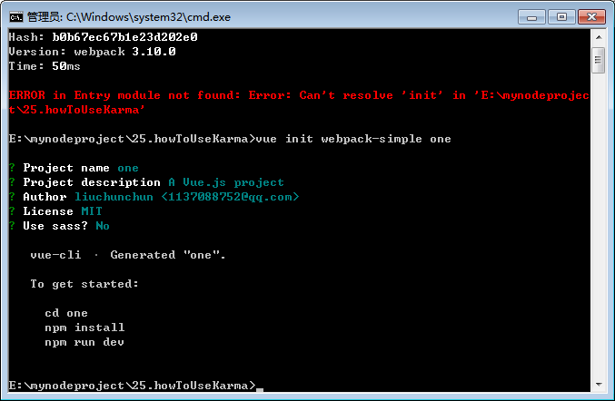

# one

> A Vue.js project

## Build Setup

``` bash
# install dependencies
npm install

# serve with hot reload at localhost:8080
npm run dev

# build for production with minification
npm run build
```

> ## 如何在 vue init webpack-simple *** 搭建的脚手架项目中使用karma来写测试？

* 参考网址

  [vue官网的](https://vue-test-utils.vuejs.org/zh/guides/#%E7%94%A8-karma-%E6%B5%8B%E8%AF%95%E5%8D%95%E6%96%87%E4%BB%B6%E7%BB%84%E4%BB%B6)

### 一：创建项目
  ##### 1.1、在控制台输入下面的指令，创建一个vue-cli的simple项目，项目名是one:
  ``` bash
    vue init webpack-simple one
  ```
* 具体操作如下图



  ##### 1.2、安装基本依赖

* 输入下面的指令
``` bash
# 进入项目
cd one

# 安装依赖
npm install --save-dev @vue/test-utils karma karma-chrome-launcher karma-mocha karma-sourcemap-loader karma-spec-reporter karma-webpack mocha

```
